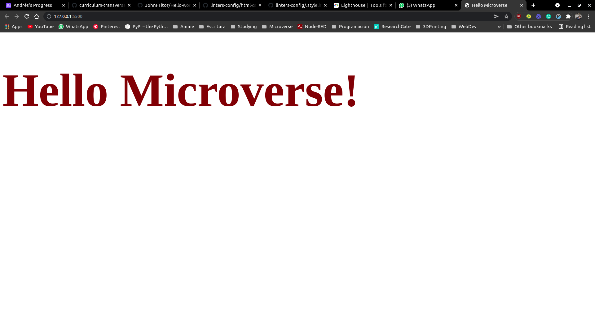

# Hello Microverse

> This project is meant to practice linters on html/css in order to used them in all Microverse Projects from now on

## Built With

- HTML/CSS
- Visual Studio

## Authors

👤 **Author1**

- GitHub: [@JohnFTitor](https://github.com/JohnFTitor)
- Twitter: [@johnftitor](https://twitter.com/johnftitor)
- LinkedIn: [Andres](https://www.linkedin.com/in/andresfelipe117/?locale=en_US)

👤 **Author2**

- GitHub: [@tanmaytyagi556](https://github.com/tanmaytyagi556)
- Twitter: [@Tanmay_Tyagi556](https://twitter.com/Tanmay_Tyagi556)
- LinkedIn: [Tanmay](https://www.linkedin.com/in/tanmay-tyagi-4bb3b91aa/)

👤 **Author3**

- GitHub: [@luis-pomare](https://github.com/luis-pomare)
- Twitter: [@LuisPomare1](https://twitter.com/LuisPomare1)
- LinkedIn: [Luis](https://www.linkedin.com/in/luis-pomare-388116225/)

## Acknowledgments

- Thanks to Microverse for the Opportunity. 

## 📝 License

This project is [MIT](./MIT.md) licensed.
